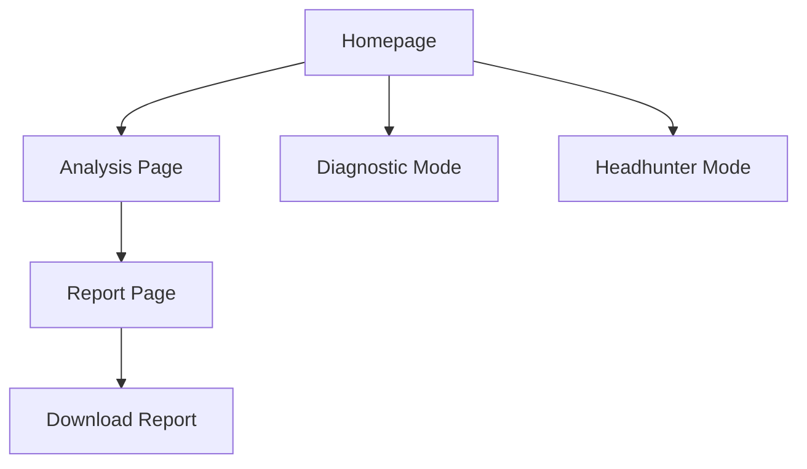

## 1. Product Overview
TalentOS - 苹果风格简约设计的简历分析工具。帮助求职者快速识别简历问题，提供专业的HRBP级分析和改进建议。

核心目标：通过极简设计提升用户体验，支持文件上传预览和报告下载功能，打造专业可信的简历优化平台。

## 2. Core Features

### 2.1 User Roles
| Role | Registration Method | Core Permissions |
|------|---------------------|------------------|
| Job Seeker | Email/Social Login | Upload resume, view analysis, download report |
| Premium User | Subscription | Full report access, STAR rewrite suggestions |
| Recruiter | Business Registration | Batch processing, candidate comparison |

### 2.2 Feature Module
苹果风格简历分析平台包含以下核心页面：

1. **Homepage**: 苹果风格Hero区域，功能选择卡片，简约导航
2. **Analysis Page**: 文件上传区域，实时预览，分析报告展示
3. **Report Page**: 详细分析结果，雷达图，下载报告按钮

### 2.3 Page Details
| Page Name | Module Name | Feature description |
|-----------|-------------|---------------------|
| Homepage | Hero Section | 展示产品核心价值，苹果风格大图配简洁文案 |
| Homepage | Feature Cards | 3个功能模块卡片：简历分析、深度诊断、猎头模式 |
| Homepage | Navigation | 顶部固定导航栏，包含语言切换和登录按钮 |
| Analysis Page | File Upload Zone | 拖拽上传简历和JD文件，支持PDF/DOCX/TXT格式 |
| Analysis Page | Preview Panel | 可折叠的实时预览面板，显示解析后的文本内容 |
| Analysis Page | Text Input | 备用文本输入框，用户可手动粘贴内容 |
| Analysis Page | Analyze Button | 醒目的开始分析按钮，苹果风格圆角设计 |
| Report Page | Score Display | 大字体显示匹配度分数，颜色编码反馈 |
| Report Page | Radar Chart | 交互式能力雷达图，展示各项能力评分 |
| Report Page | Report Content | 结构化展示分析报告，支持展开折叠 |
| Report Page | Download Button | 下载完整PDF报告按钮，苹果风格图标 |

## 3. Core Process

### 用户操作流程：
1. 用户进入首页，选择需要的分析功能
2. 上传简历文件和JD文件，系统实时解析并显示预览
3. 用户可选择查看或隐藏预览内容
4. 点击分析按钮，系统开始处理
5. 查看分析报告，包含分数、雷达图和详细建议
6. 点击下载按钮获取PDF格式报告

### 页面导航流程：

## 4. User Interface Design

### 4.1 Design Style
- **主色调**: 苹果风格白色背景，配合#007AFF蓝色强调色
- **辅助色**: #F2F2F2浅灰背景，#1D1D1F深灰文字
- **按钮风格**: 圆角矩形，渐变背景，悬停效果
- **字体**: San Francisco字体体系，标题24-32px，正文16px
- **布局**: 卡片式布局，大量留白，居中对齐
- **图标**: 线性图标，简洁现代，统一风格

### 4.2 Page Design Overview
| Page Name | Module Name | UI Elements |
|-----------|-------------|-------------|
| Homepage | Hero Section | 全屏白色背景，中心对齐的大标题"天生我才"，副标题"把15年HRD经验装进口袋"，下方3个功能卡片水平排列 |
| Analysis Page | Upload Zone | 拖拽上传区域，虚线边框，上传图标，支持文件拖拽，显示已上传文件列表，每个文件可预览或删除 |
| Analysis Page | Preview Panel | 折叠面板设计，灰色背景，显示文件解析后的前500字符，用户可手动展开查看完整内容 |
| Report Page | Score Display | 大字体显示分数（72px），绿色(80+)、橙色(60-79)、红色(<60)三色反馈，配以简要文字说明 |
| Report Page | Radar Chart | 居中显示的能力雷达图，蓝色渐变填充，半透明效果，鼠标悬停显示具体数值 |
| Report Page | Download Button | 固定在右下角的圆形按钮，下载图标，蓝色背景，点击后生成PDF报告 |

### 4.3 Responsiveness
- **桌面优先**: 基于1440px宽度的设计，支持最大1920px
- **平板适配**: 768px-1024px，卡片布局调整为2列
- **移动适配**: 375px-767px，垂直堆叠布局，触摸优化
- **交互优化**: 移动端增大点击区域，简化操作流程

### 4.4 3D Scene Guidance
不适用 - 本项目为2D界面设计