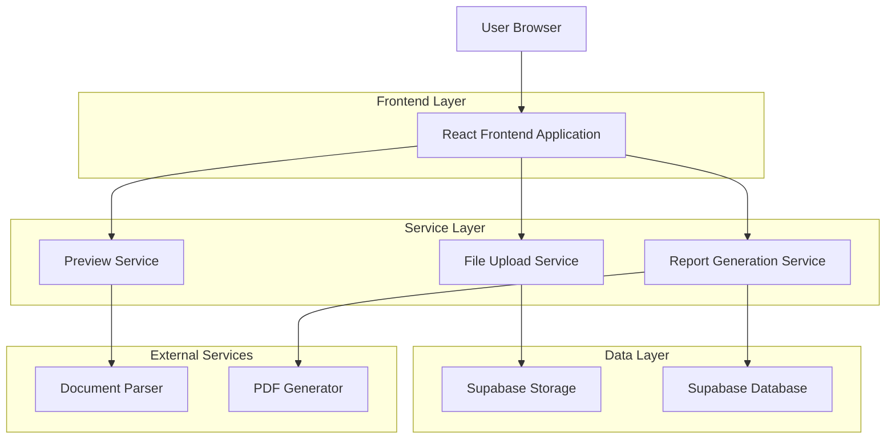
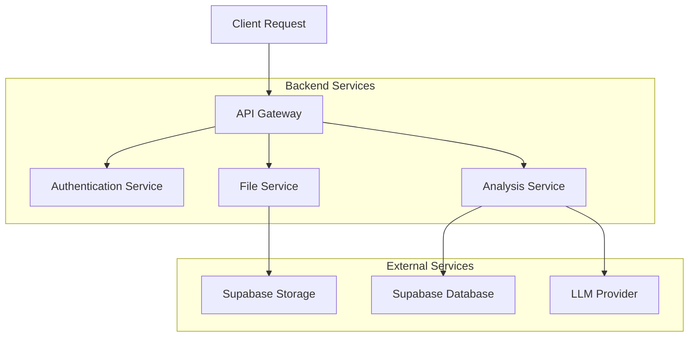
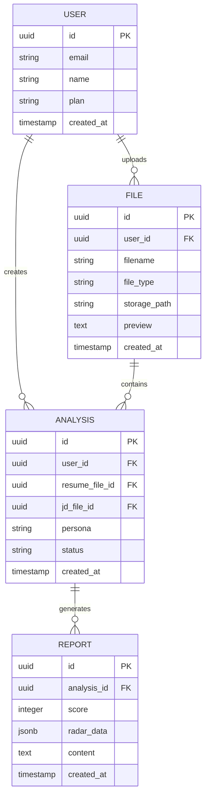

## 1. Architecture Design



## 2. Technology Description

- **Frontend**: React@18 + TypeScript + TailwindCSS@3 + Vite
- **Initialization Tool**: vite-init
- **UI Framework**: HeadlessUI + Framer Motion (动画)
- **File Processing**: react-dropzone + mammoth (DOCX) + pdf-parse
- **Chart Library**: Chart.js + react-chartjs-2
- **PDF Generation**: jspdf + html2canvas
- **Backend**: Supabase (Authentication, Database, Storage)
- **Deployment**: Vercel (Frontend) + Supabase (Backend)

## 3. Route Definitions

| Route | Purpose |
|-------|---------|
| / | Homepage - 苹果风格产品展示 |
| /analyze | 简历分析页面 - 文件上传和预览 |
| /report/:id | 分析报告页面 - 结果展示和下载 |
| /diagnostic | 深度诊断模式 |
| /headhunter | 猎头批量处理模式 |
| /auth/login | 用户登录页面 |
| /auth/register | 用户注册页面 |
| /dashboard | 用户仪表板 - 历史记录 |

## 4. API Definitions

### 4.1 File Upload API
```
POST /api/upload
```

Request:
| Param Name | Param Type | isRequired | Description |
|------------|-------------|-------------|-------------|
| files | File[] | true | 简历和JD文件 |
| type | string | true | 文件类型: resume/jd |

Response:
| Param Name | Param Type | Description |
|------------|-------------|-------------|
| fileId | string | 文件唯一标识 |
| preview | string | 前500字符预览 |
| status | string | 上传状态 |

### 4.2 Analysis API
```
POST /api/analyze
```

Request:
| Param Name | Param Type | isRequired | Description |
|------------|-------------|-------------|-------------|
| resumeId | string | true | 简历文件ID |
| jdId | string | true | JD文件ID |
| persona | string | false | 分析角色类型 |

Response:
| Param Name | Param Type | Description |
|------------|-------------|-------------|
| reportId | string | 报告唯一标识 |
| score | number | 匹配度分数 |
| radarData | object | 雷达图数据 |
| status | string | 分析状态 |

### 4.3 Report Download API
```
GET /api/report/:id/download
```

Response: PDF文件流

## 5. Server Architecture Diagram



## 6. Data Model

### 6.1 Data Model Definition



### 6.2 Data Definition Language

User Table (users)
```sql
CREATE TABLE users (
  id UUID PRIMARY KEY DEFAULT gen_random_uuid(),
  email VARCHAR(255) UNIQUE NOT NULL,
  name VARCHAR(100) NOT NULL,
  plan VARCHAR(20) DEFAULT 'free' CHECK (plan IN ('free', 'premium', 'enterprise')),
  created_at TIMESTAMP WITH TIME ZONE DEFAULT NOW(),
  updated_at TIMESTAMP WITH TIME ZONE DEFAULT NOW()
);

-- Enable Row Level Security
ALTER TABLE users ENABLE ROW LEVEL SECURITY;

-- Create policies
CREATE POLICY "Users can view own profile" ON users FOR SELECT USING (auth.uid() = id);
CREATE POLICY "Users can update own profile" ON users FOR UPDATE USING (auth.uid() = id);
```

File Table (files)
```sql
CREATE TABLE files (
  id UUID PRIMARY KEY DEFAULT gen_random_uuid(),
  user_id UUID REFERENCES users(id) ON DELETE CASCADE,
  filename VARCHAR(255) NOT NULL,
  file_type VARCHAR(50) NOT NULL,
  storage_path TEXT NOT NULL,
  preview TEXT,
  created_at TIMESTAMP WITH TIME ZONE DEFAULT NOW()
);

-- Create indexes
CREATE INDEX idx_files_user_id ON files(user_id);
CREATE INDEX idx_files_created_at ON files(created_at DESC);

-- Enable Row Level Security
ALTER TABLE files ENABLE ROW LEVEL SECURITY;

-- Create policies
CREATE POLICY "Users can view own files" ON files FOR SELECT USING (auth.uid() = user_id);
CREATE POLICY "Users can upload files" ON files FOR INSERT WITH CHECK (auth.uid() = user_id);
CREATE POLICY "Users can delete own files" ON files FOR DELETE USING (auth.uid() = user_id);
```

Analysis Table (analyses)
```sql
CREATE TABLE analyses (
  id UUID PRIMARY KEY DEFAULT gen_random_uuid(),
  user_id UUID REFERENCES users(id) ON DELETE CASCADE,
  resume_file_id UUID REFERENCES files(id),
  jd_file_id UUID REFERENCES files(id),
  persona VARCHAR(50) DEFAULT 'hrbp',
  status VARCHAR(20) DEFAULT 'pending' CHECK (status IN ('pending', 'processing', 'completed', 'failed')),
  created_at TIMESTAMP WITH TIME ZONE DEFAULT NOW(),
  updated_at TIMESTAMP WITH TIME ZONE DEFAULT NOW()
);

-- Create indexes
CREATE INDEX idx_analyses_user_id ON analyses(user_id);
CREATE INDEX idx_analyses_status ON analyses(status);
CREATE INDEX idx_analyses_created_at ON analyses(created_at DESC);

-- Enable Row Level Security
ALTER TABLE analyses ENABLE ROW LEVEL SECURITY;

-- Create policies
CREATE POLICY "Users can view own analyses" ON analyses FOR SELECT USING (auth.uid() = user_id);
CREATE POLICY "Users can create analyses" ON analyses FOR INSERT WITH CHECK (auth.uid() = user_id);
```

Report Table (reports)
```sql
CREATE TABLE reports (
  id UUID PRIMARY KEY DEFAULT gen_random_uuid(),
  analysis_id UUID REFERENCES analyses(id) ON DELETE CASCADE,
  score INTEGER CHECK (score >= 0 AND score <= 100),
  radar_data JSONB,
  content TEXT NOT NULL,
  created_at TIMESTAMP WITH TIME ZONE DEFAULT NOW()
);

-- Create indexes
CREATE INDEX idx_reports_analysis_id ON reports(analysis_id);
CREATE INDEX idx_reports_score ON reports(score);

-- Enable Row Level Security
ALTER TABLE reports ENABLE ROW LEVEL SECURITY;

-- Create policies
CREATE POLICY "Users can view own reports" ON reports FOR SELECT USING (
  EXISTS (
    SELECT 1 FROM analyses 
    WHERE analyses.id = reports.analysis_id 
    AND analyses.user_id = auth.uid()
  )
);
```