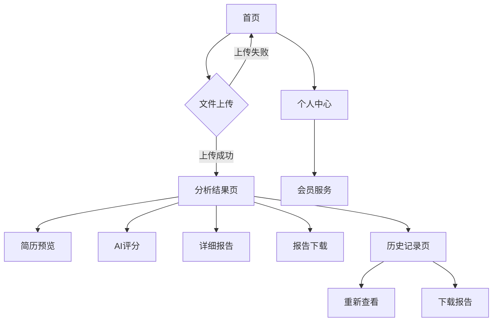

## 1. Product Overview
AI简历分析平台，支持网页端和微信小程序。用户上传简历文件，AI自动生成分析报告并提供下载功能。
- 解决求职者简历优化需求，帮助HR快速筛选候选人，提升招聘效率。
- 目标用户：求职者、HR、招聘平台。

## 2. Core Features

### 2.1 User Roles
| Role | Registration Method | Core Permissions |
|------|---------------------|------------------|
| 普通用户 | 手机号/邮箱注册 | 上传简历、查看基础报告、下载报告 |
| 高级用户 | 付费升级 | 查看详细分析、多次上传、历史记录 |
| 管理员 | 后台创建 | 查看所有用户数据、系统配置 |

### 2.2 Feature Module
核心功能页面：
1. **首页**: 上传区域、功能介绍、用户登录入口。
2. **分析结果页**: 简历预览、AI评分、详细分析报告。
3. **历史记录页**: 过往分析记录、报告下载、删除功能。
4. **个人中心**: 用户信息、会员状态、设置选项。

### 2.3 Page Details
| Page Name | Module Name | Feature description |
|-----------|-------------|---------------------|
| 首页 | 文件上传区 | 拖拽上传简历文件，支持PDF/DOC/DOCX格式，文件大小限制10MB，实时上传进度显示。 |
| 首页 | 登录入口 | 手机号快捷登录、微信授权登录，支持游客模式浏览。 |
| 分析结果页 | 简历预览 | 在线预览上传的简历文件，支持分页查看、缩放、旋转功能。 |
| 分析结果页 | AI评分 | 显示综合评分、各项能力评分雷达图，包括技能匹配度、经验深度、教育背景等维度。 |
| 分析结果页 | 详细报告 | 展示AI生成的详细分析报告，包含优势分析、改进建议、关键词优化建议。 |
| 分析结果页 | 报告下载 | 提供PDF格式报告下载，包含水印和防伪标识，支持一键分享到微信。 |
| 历史记录页 | 记录列表 | 显示历史分析记录，包含文件名称、分析时间、评分信息。 |
| 历史记录页 | 记录操作 | 支持重新查看报告、下载报告、删除记录功能。 |
| 个人中心 | 用户信息 | 显示头像、昵称、会员等级、剩余分析次数。 |
| 个人中心 | 会员服务 | 展示会员权益、价格套餐、支付入口。 |

## 3. Core Process
用户操作流程：
1. 用户访问首页，选择上传简历文件或拍照上传
2. 系统自动识别文件格式并开始上传
3. 上传完成后跳转到分析结果页，显示AI分析结果
4. 用户可在线预览简历、查看详细报告、下载PDF报告
5. 分析记录自动保存到历史记录，支持后续查看

小程序特有流程：
1. 支持微信一键登录和手机号验证
2. 支持从微信聊天中选择文件上传
3. 支持拍照识别简历内容
4. 支持一键分享到微信好友和朋友圈

## 4. User Interface Design

### 4.1 Design Style
- 主色调：科技蓝 (#1890ff) + 纯白背景
- 辅助色：成功绿 (#52c41a)、警告橙 (#faad14)、错误红 (#f5222d)
- 按钮风格：圆角矩形，主按钮实心，次要按钮描边
- 字体：PingFang SC (iOS)、Microsoft YaHei (Windows)、系统默认字体
- 布局风格：卡片式布局，左右分栏设计，响应式网格系统
- 图标风格：线性图标，简洁现代风格，使用Ant Design图标库

### 4.2 Page Design Overview
| Page Name | Module Name | UI Elements |
|-----------|-------------|-------------|
| 首页 | 文件上传区 | 拖拽区域300px高度，虚线边框，上传图标居中，支持拖拽高亮效果，进度条显示上传进度。 |
| 分析结果页 | 评分卡片 | 圆形进度条显示综合评分，雷达图展示各项能力评分，卡片阴影效果，评分数字大字体显示。 |
| 分析结果页 | 报告内容 | 分段式卡片布局，标题使用18px加粗字体，内容14px常规字体，行间距1.5倍，关键信息高亮显示。 |
| 历史记录页 | 记录卡片 | 列表式布局，每行显示文件图标、文件名、分析时间、评分，支持左滑删除操作。 |
| 个人中心 | 信息展示 | 顶部用户头像圆形显示，昵称16px加粗，会员等级标签彩色显示，功能列表分组展示。 |

### 4.3 Responsiveness
- 桌面端优先设计，最大宽度1200px居中显示
- 平板端自适应，采用响应式网格系统
- 移动端优化，触摸友好的按钮尺寸（最小44px）
- 小程序端遵循微信设计规范，适配不同屏幕尺寸

### 4.4 3D Scene Guidance
不适用 - 本产品为文档处理和数据分析类应用，无需3D场景。