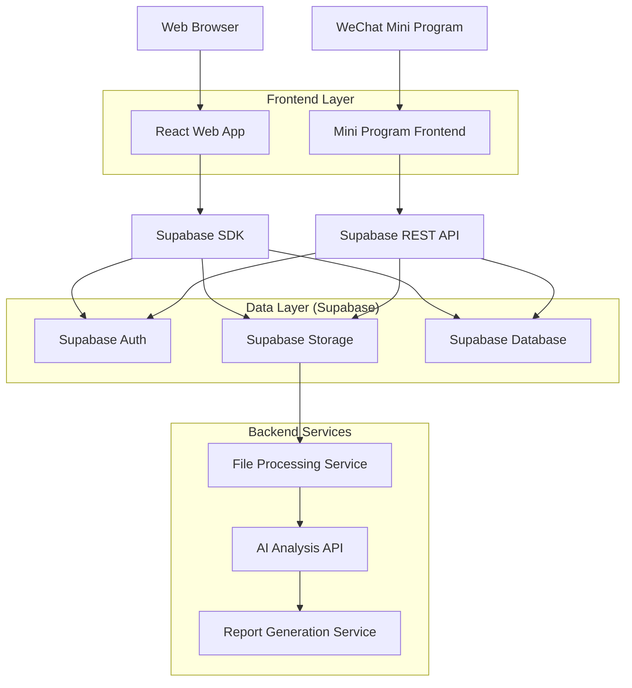
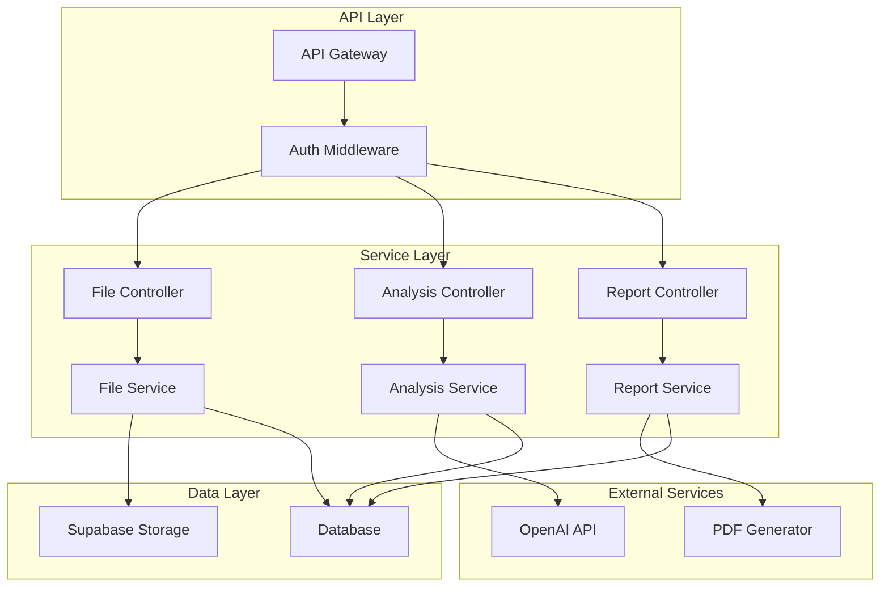
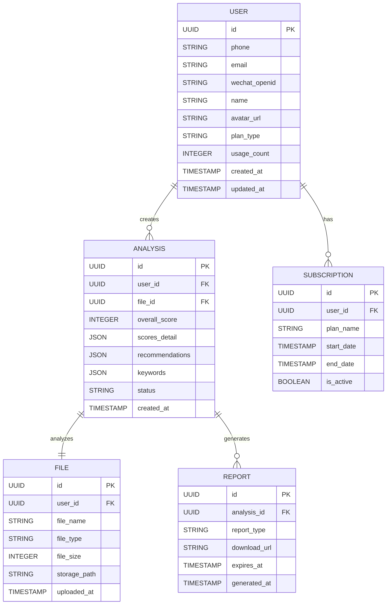

## 1. Architecture design



## 2. Technology Description

- **Web Frontend**: React@18 + TypeScript + TailwindCSS@3 + Vite
- **Mini Program**: 原生微信小程序 + TypeScript + Vant Weapp UI库
- **Initialization Tool**: vite-init (Web端)、微信开发者工具 (小程序)
- **Backend**: Supabase (BaaS平台)
- **File Storage**: Supabase Storage
- **Database**: Supabase PostgreSQL
- **AI服务**: OpenAI GPT-4 API (简历分析)
- **PDF生成**: Puppeteer + HTML模板

## 3. Route definitions

### Web端路由
| Route | Purpose |
|-------|---------|
| / | 首页，文件上传入口 |
| /login | 登录页面，支持手机号和微信扫码登录 |
| /analyze/:id | 分析结果页面，显示AI分析结果 |
| /history | 历史记录页面，查看过往分析 |
| /profile | 个人中心，用户信息和设置 |
| /payment | 会员购买页面 |

### 小程序页面
| Page | Purpose |
|------|---------|
| pages/index/index | 首页，文件上传 |
| pages/result/result | 分析结果展示 |
| pages/history/history | 历史记录 |
| pages/profile/profile | 个人中心 |
| pages/webview/webview | WebView页面，用于复杂展示 |

## 4. API definitions

### 4.1 文件上传API
```
POST /api/files/upload
```

Request:
| Param Name | Param Type | isRequired | Description |
|------------|------------|------------|-------------|
| file | File | true | 简历文件，支持PDF/DOC/DOCX |
| user_id | string | true | 用户ID |
| file_name | string | false | 文件名 |

Response:
```json
{
  "file_id": "uuid",
  "upload_url": "https://...",
  "status": "uploaded",
  "file_size": 1024000
}
```

### 4.2 简历分析API
```
POST /api/analyze
```

Request:
| Param Name | Param Type | isRequired | Description |
|------------|------------|------------|-------------|
| file_id | string | true | 文件ID |
| user_id | string | true | 用户ID |

Response:
```json
{
  "analysis_id": "uuid",
  "overall_score": 85,
  "skills_score": 90,
  "experience_score": 80,
  "education_score": 85,
  "recommendations": ["建议1", "建议2"],
  "keywords": ["JavaScript", "React"],
  "report_url": "https://..."
}
```

### 4.3 报告生成API
```
POST /api/reports/generate
```

Request:
| Param Name | Param Type | isRequired | Description |
|------------|------------|------------|-------------|
| analysis_id | string | true | 分析记录ID |
| template_id | string | false | 模板ID，默认标准模板 |

Response:
```json
{
  "report_id": "uuid",
  "download_url": "https://...",
  "expires_at": "2026-01-15T12:00:00Z"
}
```

## 5. Server architecture diagram



## 6. Data model

### 6.1 Data model definition


### 6.2 Data Definition Language

用户表 (users)
```sql
CREATE TABLE users (
    id UUID PRIMARY KEY DEFAULT gen_random_uuid(),
    phone VARCHAR(20) UNIQUE,
    email VARCHAR(255) UNIQUE,
    wechat_openid VARCHAR(100) UNIQUE,
    name VARCHAR(100) NOT NULL,
    avatar_url TEXT,
    plan_type VARCHAR(20) DEFAULT 'free' CHECK (plan_type IN ('free', 'basic', 'premium')),
    usage_count INTEGER DEFAULT 0,
    created_at TIMESTAMP WITH TIME ZONE DEFAULT NOW(),
    updated_at TIMESTAMP WITH TIME ZONE DEFAULT NOW()
);

-- 索引
CREATE INDEX idx_users_phone ON users(phone);
CREATE INDEX idx_users_email ON users(email);
CREATE INDEX idx_users_wechat ON users(wechat_openid);
```

文件表 (files)
```sql
CREATE TABLE files (
    id UUID PRIMARY KEY DEFAULT gen_random_uuid(),
    user_id UUID NOT NULL REFERENCES users(id) ON DELETE CASCADE,
    file_name VARCHAR(255) NOT NULL,
    file_type VARCHAR(50) NOT NULL CHECK (file_type IN ('pdf', 'doc', 'docx')),
    file_size INTEGER NOT NULL CHECK (file_size > 0 AND file_size <= 10485760),
    storage_path TEXT NOT NULL,
    uploaded_at TIMESTAMP WITH TIME ZONE DEFAULT NOW()
);

-- 索引
CREATE INDEX idx_files_user_id ON files(user_id);
CREATE INDEX idx_files_uploaded_at ON files(uploaded_at DESC);
```

分析记录表 (analyses)
```sql
CREATE TABLE analyses (
    id UUID PRIMARY KEY DEFAULT gen_random_uuid(),
    user_id UUID NOT NULL REFERENCES users(id) ON DELETE CASCADE,
    file_id UUID NOT NULL REFERENCES files(id) ON DELETE CASCADE,
    overall_score INTEGER CHECK (overall_score >= 0 AND overall_score <= 100),
    scores_detail JSONB NOT NULL,
    recommendations JSONB NOT NULL,
    keywords JSONB NOT NULL,
    status VARCHAR(20) DEFAULT 'pending' CHECK (status IN ('pending', 'processing', 'completed', 'failed')),
    created_at TIMESTAMP WITH TIME ZONE DEFAULT NOW()
);

-- 索引
CREATE INDEX idx_analyses_user_id ON analyses(user_id);
CREATE INDEX idx_analyses_file_id ON analyses(file_id);
CREATE INDEX idx_analyses_created_at ON analyses(created_at DESC);
CREATE INDEX idx_analyses_status ON analyses(status);
```

报告表 (reports)
```sql
CREATE TABLE reports (
    id UUID PRIMARY KEY DEFAULT gen_random_uuid(),
    analysis_id UUID NOT NULL REFERENCES analyses(id) ON DELETE CASCADE,
    report_type VARCHAR(50) DEFAULT 'standard' CHECK (report_type IN ('standard', 'detailed', 'premium')),
    download_url TEXT NOT NULL,
    expires_at TIMESTAMP WITH TIME ZONE NOT NULL,
    generated_at TIMESTAMP WITH TIME ZONE DEFAULT NOW()
);

-- 索引
CREATE INDEX idx_reports_analysis_id ON reports(analysis_id);
CREATE INDEX idx_reports_expires_at ON reports(expires_at);
```

### 6.3 Supabase RLS策略

-- 用户只能访问自己的数据
```sql
-- 文件访问策略
ALTER TABLE files ENABLE ROW LEVEL SECURITY;
CREATE POLICY "Users can view own files" ON files FOR SELECT 
    USING (auth.uid() = user_id);
CREATE POLICY "Users can insert own files" ON files FOR INSERT 
    WITH CHECK (auth.uid() = user_id);

-- 分析记录访问策略
ALTER TABLE analyses ENABLE ROW LEVEL SECURITY;
CREATE POLICY "Users can view own analyses" ON analyses FOR SELECT 
    USING (auth.uid() = user_id);

-- 报告访问策略
ALTER TABLE reports ENABLE ROW LEVEL SECURITY;
CREATE POLICY "Users can download own reports" ON reports FOR SELECT 
    USING (EXISTS (
        SELECT 1 FROM analyses 
        WHERE analyses.id = reports.analysis_id 
        AND analyses.user_id = auth.uid()
    ));
```

### 6.4 初始数据
```sql
-- 插入默认会员套餐配置
INSERT INTO subscription_plans (plan_name, price_monthly, price_yearly, features, max_analyses) VALUES
('free', 0, 0, '{\"basic_analysis\": true, \"pdf_download\": false}', 3),
('basic', 29, 290, '{\"basic_analysis\": true, \"pdf_download\": true, \"detailed_report\": true}', 20),
('premium', 99, 990, '{\"basic_analysis\": true, \"pdf_download\": true, \"detailed_report\": true, \"priority_support\": true}', 999