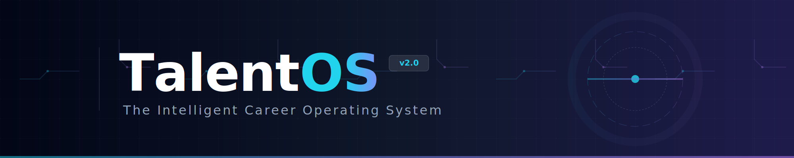

<div align="center">
  

  # TalentOS：智能招聘操作系统
  
  [](https://opensource.org/licenses/MIT)
  [](https://www.python.org/downloads/)
  [](https://fastapi.tiangolo.com)
  [](https://react.dev)
</div>

**TalentOS 不是工具，是招聘行业的底层操作系统。**

告别直觉盲赌，用算法重构连接。
*   **B端“人才雷达”**：开启上帝视角，6秒锁定 Top 1% 顶尖人才。
*   **C端“职场黑客”**：逆向解析筛选逻辑，让才华不被算法埋没。

**数据驱动，降维打击。**

---

## 💰 商业变现 (Monetization Strategy)

我们不只是写代码，我们是在构建**资产**。TalentOS 具备多维度的商业化潜力：

### 1. SaaS 订阅模式 (B端核心)
*   **Freemium**: 基础简历解析免费，吸引流量。
*   **Pro ($299/月)**: 批量解析、自定义人岗匹配模型、自动拒信/邀约生成。
*   **Enterprise (定制)**: 私有化部署、本地模型训练 (Local LLM)、API 对接。

### 2. 增值服务 (C端高频)
*   **简历精修 ($9.9/次)**: 基于 JD 的针对性简历优化建议。
*   **面试模拟 ($19.9/次)**: AI 面试官实战演练，生成能力评估报告。

### 3. API 经济 (开发者生态)
*   开放 **Resume Parsing API** 和 **Matching API**，按 Token 或调用次数计费，赋能其他招聘平台或猎头系统。

---

## ⚡ 核心战役 (The Campaign)

### 🏴‍☠️ C-Side: Career Hacker (职场黑客)
> **Slogan**: "Don't Apply. Upgrade." (别投递，去升级。)

*   **黑盒逆向**: 你的简历为什么被挂？TalentOS 模拟千万级 HR 数据，提前 6 秒告诉你答案。
*   **降维打击**: 这是一个不公平的战场。带上 TalentOS 的“外骨骼装甲”，用 AI 的逻辑击败 AI 的筛选。

### 👁️ B-Side: Talent Radar (人才雷达)
> **Slogan**: "Stop Guessing. Start Seeing." (别猜了，看清真相。)

*   **上帝视角**: 忽略排版噪音，直接透视候选人的“能力骨架”。
*   **光速收割**: 1000 份简历？不，那是 1000 个待扫描的数据点。一键锁定 Top 5，让招聘变成一场精准的外科手术。

---

## 🚀 1. 系统模块 (System Modules)

我们已经完成了从“单点工具”到“智能招聘工作台”的闭环构建：

### 🧠 核心引擎 (Core Engine)
*   **全格式解析**: 强力解析 PDF, DOCX, TXT, MD 等多种格式的简历与 JD（基于 `MarkItDown` & `Docling`）。
*   **结构化提取**: 利用 LLM 将非结构化简历转化为标准 JSON（个人信息、教育、经历、技能）。
*   **智能诊断 (C端)**: 模拟资深 HR 视角，提供 6 秒简历速览评分、致命伤预警及 STAR 法则重写建议。

### 🏢 HR 招聘工作台 (HR Dashboard)
*   **📂 批量简历大杀器**:
    *   **海量处理**: 支持文件夹级批量上传简历，自动提取核心信息并生成结构化对比报表。
    *   **动态 JD 注入**: 支持手动输入 JD 文本或直接上传 JD 文件（PDF/Word），AI 自动提取关键胜任力模型。
*   **🎯 多维人岗匹配 (Smart Matching)**:
    *   **自定义模型**: 提供 **`MatchModelConfig`** 配置面板，允许 HR 自定义 **技能/经验/教育/软素质** 的权重占比（如：校招场景调高教育权重，社招场景调高经验权重）。
    *   **深度评分**: 输出 0-100 分匹配度，给出“合适/不合适”结论及高度概括的理由，拒绝模棱两可。
*   **🤖 自动化沟通 (Auto-Communication)**:
    *   **批量反馈**: 针对“不合适”候选人自动生成拒信，针对“合适”候选人生成邀约信。
    *   **风格控制**: 支持“专业、亲和、直接”等多种沟通语气的切换。
*   **✨ JD 智能优化**:
    *   深度诊断原始 JD，利用大数据优化关键词，提升人才匹配精准度，支持 **Markdown 导出**。

---

## 💡 2. 技术亮点 (Key Highlights)

*   **架构灵活性 (Abstract First)**:
    *   **LLM-First Design**: 核心逻辑由 Prompt (`engine.py`) 驱动而非硬编码规则，适应新行业/语种只需调整 Prompt。
    *   **Plugin Architecture**: 简历解析器与 LLM 提供商均采用插件化设计，易于扩展。
*   **数据驱动决策 (Data-Driven)**:
    *   人岗匹配不再是简单的关键词匹配 (Keyword Matching)，而是基于语义理解 (Semantic Understanding) 的多维度加权打分系统。
*   **极致开发者体验 (DX)**:
    *   **Type-Safe**: 全栈 TypeScript + Python 类型提示。
    *   **Mock Data**: 内置 `generate_mock_resumes.py` 脚本，一键生成高质量合成数据用于测试。
    *   **Separation of Concerns**: 清晰的前后端分离架构 (React + FastAPI)。

---

## 🗺️ 3. 迭代计划 (Roadmap)

### P0: 架构稳健性 (Stability)
- [ ] **异步任务队列**: 引入 `Celery` + `Redis` 替代当前的同步循环处理，解决大批量解析时的超时问题。
- [ ] **数据持久化**: 引入 `PostgreSQL` 或 `SQLite`，持久化存储候选人库、解析记录和匹配历史。

### P1: 深度智能 (Deep AI)
- [ ] **RAG 增强**: 引入向量数据库 (ChromaDB/Milvus)，构建企业人才知识库，支持自然语言搜索（例：“找一个懂 React 且做过电商项目的 5 年经验前端”）。
- [ ] **本地模型支持**: 支持 Ollama/LocalLLM，允许企业在本地运行 DeepSeek/Llama 模型，确保数据隐私。

### P2: 体验升级 (UX)
- [ ] **可视化报表**: Dashboard 增加人才分布图表（学历分布、技能词云、匹配度直方图）。
- [ ] **AI 面试官**: 实现 Chatbot 预面试功能，自动与候选人对话并生成面试摘要。

---

## ⚡ 4. 快速开始 (Quick Start)

### 后端 (Backend)
```bash
# 1. 环境准备
cd TalentOS
python -m venv venv
.\venv\Scripts\activate  # Windows

# 2. 安装依赖
pip install -r requirements.txt

# 3. 配置密钥 (复制 config/.env.example 到 .env 并填入 Key)
# DEEPSEEK_API_KEY="sk-..."

# 4. 启动服务
python -m uvicorn src.api_server:app --reload
```

### 前端 (Frontend)
```bash
# 1. 进入目录
cd frontend-web

# 2. 安装依赖 (推荐 pnpm)
pnpm install

# 3. 启动开发服
pnpm dev
```

---

## 🛠️ 技术栈 (Tech Stack)

*   **Backend**: Python 3.9+, FastAPI, Pydantic
*   **Frontend**: React 18, TypeScript, TailwindCSS, Lucide Icons
*   **AI Engine**: DeepSeek-V3 (Reasoning Mode), OpenAI
*   **Parsing**: Docling, MarkItDown, pdfplumber
